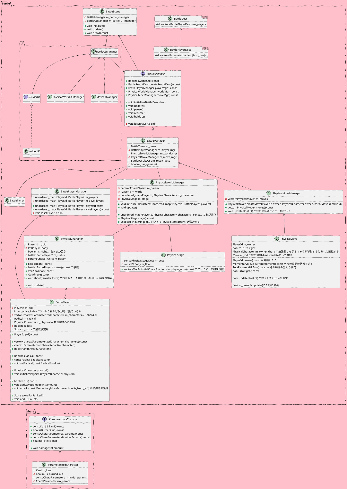

# BattleScene

## todo
- [ ] 漢字
    - [ ] 物理的実体
        - [ ] mgr
    - [ ] 名目的存在
        - [ ] holder
    - [ ] param
        - [ ] static
        - [ ] dynamic
    - [ ] 部首
        - [ ] mgr
    - [ ] 技
        - [ ] mgr
        - [ ] 通常
        - [ ] 必殺
            - [ ] エフェクト
- [ ] timer
    - [ ] 開始
    - [ ] 終了
    - [ ] 演出
    - [ ] pause/resume
- [ ] sequence
    - [ ] pause
    - [ ] resume
    - [ ] no contest
    - [ ] in from stage select
    - [ ] out to result
- [ ] 図鑑
    - [ ] parmanent
    - [ ] temporal
        - [ ] 黒板
- [ ] ui

## uml

