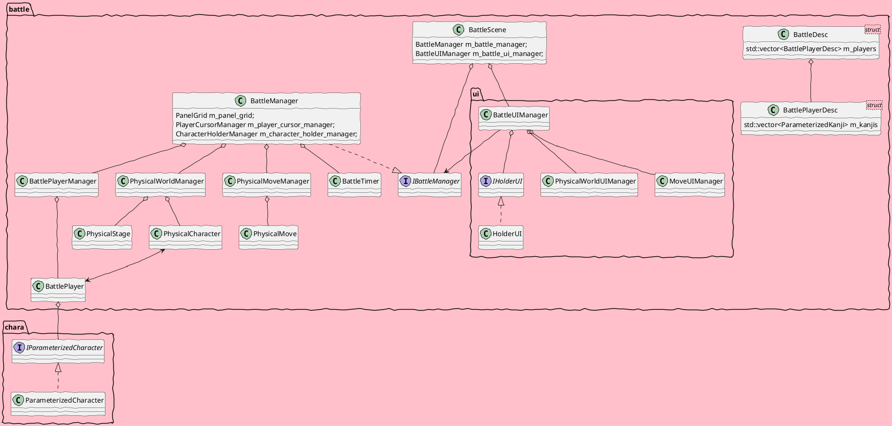

# BattleScene

## todo
- [ ] 漢字
    - [ ] 物理的実体
        - [ ] mgr
    - [ ] 名目的存在
        - [ ] holder
    - [ ] param
        - [ ] static
        - [ ] dynamic
    - [ ] 部首
        - [ ] mgr
    - [ ] 技
        - [ ] mgr
        - [ ] 通常
        - [ ] 必殺
            - [ ] エフェクト
- [ ] timer
    - [ ] 開始
    - [ ] 終了
    - [ ] 演出
    - [ ] pause/resume
- [ ] sequence
    - [ ] pause
    - [ ] resume
    - [ ] no contest
    - [ ] in from stage select
    - [ ] out to result
- [ ] 図鑑
    - [ ] parmanent
    - [ ] temporal
        - [ ] 黒板
- [ ] ui

## uml

- 要件
    - 引数は解析前の情報を受取る
        - 将来的に、文字列解析/数値to文字列/ストリーム出力 のコストを外部に逃がすため
        - バイナリデータ、TCP通信
    - 送信前提の蓄積方法
        - ダブルバッファリング
    - 大規模ログの受容と活用
        - 圧縮
        - グラフ化
        - ビューワ

出力class を差し替えて内部出力/外部出力を切り替える
Error/Info/Debug

~~~cpp
void main() {
dx::dbg::Log(const s3d::String& );
LogInfo() / LogDebug() / LogError()
category_name, body, args...
args... = key_string, value
Extract / Transform / Load
[Layer.Layer2.Layer3]
}
~~~