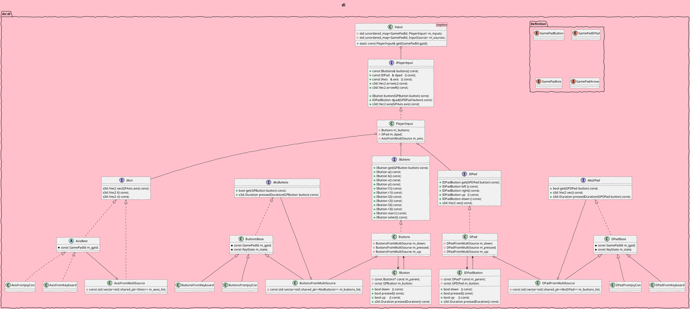

```plantuml
@startuml

skinparam backgroundColor pink
skinparam handwritten true

title <size:18> di </size>

package dx::di {

	package Definition {
		enum GamePadButton
		enum GamePadDPad
		enum GamePadAxis
		enum GamePadArrow
	}

	class Input <singleton> {
		+static const PlayerInput& get(GamePadId gpid);
		-std::unordered_map<GamePadId, PlayerInput> m_inputs;
		-std::unordered_map<GamePadId, InputSource> m_sources;
	}

	interface IPlayerInput {
    	+const IButtons& buttons() const;
    	+const IDPad   & dpad   () const;
    	+const IAxis   & axis   () const;
    	+s3d::Vec2 arrowL() const;
    	+s3d::Vec2 arrowR() const;

    	+IButton button(GPButton button) const;
    	+IDPadButton dpad(GPDPad button) const;
    	+s3d::Vec2 axis(GPAxis axis) const;
	}

	Input o--IPlayerInput

	class PlayerInput {
		-Buttons m_buttons;
		-DPad m_dpad;
		-AxisFromMultiSource m_axis;
	}
	IPlayerInput <|.. PlayerInput

	interface IButtons {
		+IButton get(GPButton button) const;
		+IButton a() const;
		+IButton b() const;
		+IButton x() const;
		+IButton y() const;
		+IButton l1() const;
		+IButton r1() const;
		+IButton l2() const;
		+IButton r2() const;
		+IButton l3() const;
		+IButton r3() const;
		+IButton start () const;
		+IButton select() const;
	}

	class Buttons {
		-ButtonsFromMultiSource m_down;
		-ButtonsFromMultiSource m_pressed;
		-ButtonsFromMultiSource m_up;
	}

	Buttons .up.|> IButtons

	class IButton {
		+bool down   () const;
		+bool pressed() const;
		+bool up     () const;
		+s3d::Duration pressedDuration() const;
		-const Buttons* const m_parent;
		-const GPButton m_button;
	}

	Buttons --> IButton
	Buttons <-- IButton

	interface AbsButtons {
		+bool get(GPButton button) const;
		+s3d::Duration pressedDuration(GPButton button) const;
	}

	class ButtonsBase {
		*const GamePadId m_gpid;
		*const KeyState m_state;
	}

	ButtonsBase .up.|> AbsButtons

	ButtonsFromKeyboard -up-|> ButtonsBase
	ButtonsFromJoyCon -up-|> ButtonsBase
	class ButtonsFromMultiSource {
		-const std::vector<std::shared_ptr<AbsButtons>> m_buttons_list;
	}
	ButtonsFromMultiSource -up-|> ButtonsBase

	ButtonsFromMultiSource o-up- AbsButtons
	Buttons o-- ButtonsFromMultiSource

	interface IDPad {
		+IDPadButton get(GPDPad button) const;
		+IDPadButton left () const;
		+IDPadButton right() const;
		+IDPadButton up   () const;
		+IDPadButton down () const;
		+s3d::Vec2 vec() const;
	}

	class DPad {
		-DPadFromMultiSource m_down;
		-DPadFromMultiSource m_pressed;
		-DPadFromMultiSource m_up;
	}

	DPad .up.|> IDPad

	class IDPadButton {
		+bool down   () const;
		+bool pressed() const;
		+bool up     () const;
		+s3d::Duration pressedDuration() const;
		-const DPad* const m_parent;
		-const GPDPad m_button;
	}

	DPad --> IDPadButton
	DPad <-- IDPadButton

	interface AbsDPad {
		+bool get(GPDPad button) const;
		+s3d::Vec2 vec() const;
		+s3d::Duration pressedDuration(GPDPad button) const;
	}

	class DPadBase {
		*const GamePadId m_gpid;
		*const KeyState m_state;
	}

	DPadBase .up.|> AbsDPad

	DPadFromKeyboard -up-|> DPadBase
	DPadFromJoyCon -up-|> DPadBase
	class DPadFromMultiSource {
		-const std::vector<std::shared_ptr<AbsDPad>> m_buttons_list;
	}
	DPadFromMultiSource -up-|> DPadBase

	DPadFromMultiSource o-up- AbsDPad
	DPad o-- DPadFromMultiSource

	interface IAxis {
		s3d::Vec2 vec(GPAxis axis) const;
		s3d::Vec2 l() const;
		s3d::Vec2 r() const;
	}

	abstract AxisBase {
		*const GamePadId m_gpid;
	}

	AxisBase .up.|> IAxis

	class AxisFromMultiSource {
		-const std::vector<std::shared_ptr<IAxis>> m_axes_list;
	}

	AxisFromKeyboard .up.|> AxisBase
	AxisFromJoyCon .up.|> AxisBase
	AxisFromMultiSource ..up.|> IAxis
	AxisFromMultiSource o-up- AxisBase

	PlayerInput o-- IButtons
	PlayerInput o-- IDPad
	PlayerInput o-- IAxis


}

@enduml
```
