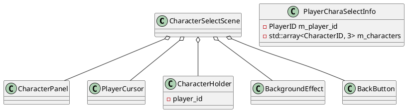
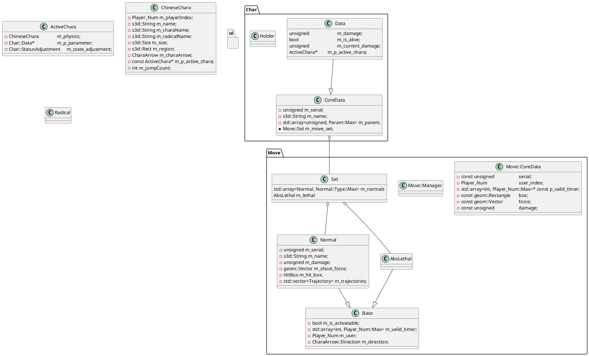

```plantuml
@startuml

class CharacterSelectScene {
}

CharacterSelectScene o-- CharacterPanel
CharacterSelectScene o-- PlayerCursor
CharacterSelectScene o-- CharacterHolder
CharacterSelectScene o-- BackgroundEffect
CharacterSelectScene o-- BackButton

class CharacterHolder {
    - player_id
}

class PlayerCharaSelectInfo {
    - PlayerID m_player_id
    - std::array<CharacterID, 3> m_characters
}

@enduml
```

---

```plantuml
@startuml

package Char {

class CoreData {
    - unsigned m_serial;
    - s3d::String m_name;
    - std::array<unsigned, Param::Max> m_param;
    * Move::Set m_move_set;
}

class Data {
    unsigned			m_damage;
    bool				m_is_alive;
    unsigned			m_current_damage;
    ActiveChara*		m_p_active_chara;
}

Data --|> CoreData

class Holder {

}

}

class ActiveChara {
	- ChineseChara		m_physics;
	- Char::Data*			m_p_parameter;
	- Char::StatusAdjustment	m_state_adjustment;
}

class ChineseChara {
	- Player_Num m_playerIndex;
	- s3d::String m_name;
	- s3d::String m_charaName;
	- s3d::String m_radicalName;
	- s3d::Size m_size;
	- s3d::Rect m_region;
	- CharaArrow m_charaArrow;
	- const ActiveChara* m_p_active_chara;
	- int m_jumpCount;
}

package Move {

class Move::CoreData {
    - const unsigned			serial;
    - Player_Num				user_index;
    - std::array<int, Player_Num::Max>* const p_valid_timer;
    - const geom::Rectangle	box;
    - const geom::Vector		force;
    - const unsigned			damage;
}

class Move::Manager {

}

class Base {
    - bool m_is_activatable;
    - std::array<int, Player_Num::Max> m_valid_timer;
    - Player_Num m_user;
    - CharaArrow::Direction m_direction;
}

class Normal {
    - unsigned m_serial;
    - s3d::String m_name;
    - unsigned m_damage;
    - geom::Vector m_shoot_force;
    - HitBox m_hit_box;
    - std::vector<Trajectory> m_trajectories;
}

class AbsLethal {

}

class Set {
    std::array<Normal, Normal::Type::Max> m_normals
    AbsLethal m_lethal
}

Normal --|> Base
AbsLethal --|> Base
Set o-- Normal
Set o-- AbsLethal

}

CoreData o-- Set

class Radical {

}


package ui {

}

@enduml
```
