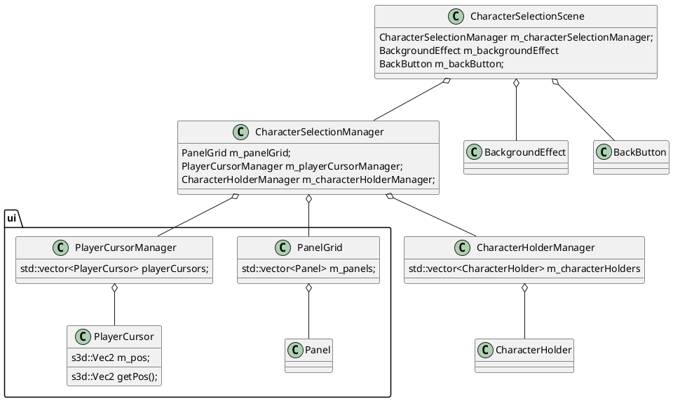

# Client UML

```plantuml
@startuml

class CharacterSelectionScene {
    CharacterSelectionManager m_characterSelectionManager;
    BackgroundEffect m_backgroundEffect
    BackButton m_backButton;
}

class CharacterHolderManager {
    std::vector<CharacterHolder> m_characterHolders
}

class CharacterSelectionManager {
    PanelGrid m_panelGrid;
    PlayerCursorManager m_playerCursorManager;
    CharacterHolderManager m_characterHolderManager;
}

package ui {

class PanelGrid {
    std::vector<Panel> m_panels;
}

class Panel {
}

class PlayerCursor {
    s3d::Vec2 m_pos;
    s3d::Vec2 getPos();
}

class PlayerCursorManager {
    std::vector<PlayerCursor> playerCursors;
}

PlayerCursorManager o-- PlayerCursor
PanelGrid o-- Panel

}

CharacterSelectionScene o-- BackgroundEffect
CharacterSelectionScene o-- BackButton
CharacterSelectionScene o-- CharacterSelectionManager

CharacterSelectionManager o-- PlayerCursorManager
CharacterSelectionManager o-- CharacterHolderManager
CharacterSelectionManager o-- PanelGrid

CharacterHolderManager o-- CharacterHolder

@enduml
```
