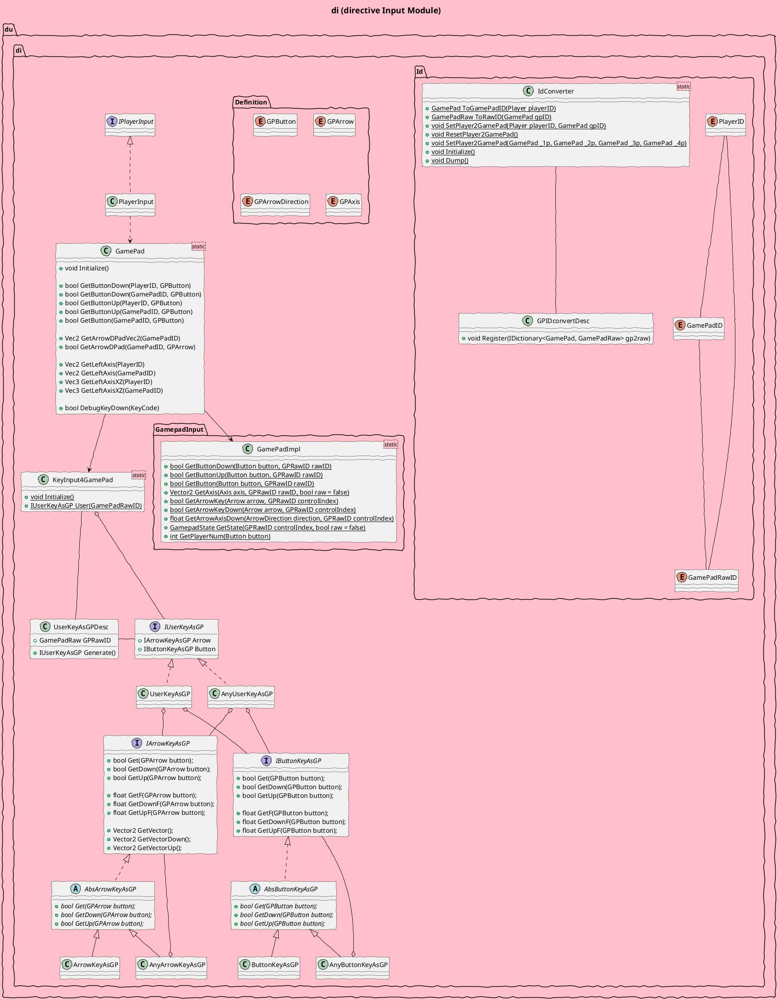

```plantuml
@startuml

skinparam backgroundColor pink
skinparam handwritten true

title <size:18> di (directive Input Module) </size>

package du {
	package di {

		package Id {
			enum PlayerID
			enum GamePadID
			enum GamePadRawID
			PlayerID --- GamePadID
			GamePadID --- GamePadRawID
			GamePadRawID --- PlayerID

			class IdConverter <static> {
				+{static} GamePad ToGamePadID(Player playerID)
				+{static} GamePadRaw ToRawID(GamePad gpID)
				+{static} void SetPlayer2GamePad(Player playerID, GamePad gpID)
				+{static} void ResetPlayer2GamePad()
				+{static} void SetPlayer2GamePad(GamePad _1p, GamePad _2p, GamePad _3p, GamePad _4p)
				+{static} void Initialize()
				+{static} void Dump()
			}
			class GPIDconvertDesc {
				+void Register(IDictionary<GamePad, GamePadRaw> gp2raw)
			}
			IdConverter --- GPIDconvertDesc
		}

		package Definition {
			enum GPButton
			enum GPArrow
			enum GPArrowDirection
			enum GPAxis
		}

		interface IUserKeyAsGP {
			+IArrowKeyAsGP Arrow
			+IButtonKeyAsGP Button
		}
		IUserKeyAsGP <|.. UserKeyAsGP
		IUserKeyAsGP <|.. AnyUserKeyAsGP
		UserKeyAsGP o-down- IArrowKeyAsGP
		UserKeyAsGP o-down- IButtonKeyAsGP
		AnyUserKeyAsGP o-down- IArrowKeyAsGP
		AnyUserKeyAsGP o-down- IButtonKeyAsGP

		interface IButtonKeyAsGP {
			+bool Get(GPButton button);
			+bool GetDown(GPButton button);
			+bool GetUp(GPButton button);

			+float GetF(GPButton button);
			+float GetDownF(GPButton button);
			+float GetUpF(GPButton button);
		}
		abstract AbsButtonKeyAsGP {
			{abstract}+bool Get(GPButton button);
			{abstract}+bool GetDown(GPButton button);
			{abstract}+bool GetUp(GPButton button);
		}
		IButtonKeyAsGP <|.. AbsButtonKeyAsGP
		AbsButtonKeyAsGP <|-- ButtonKeyAsGP
		AbsButtonKeyAsGP <|-- AnyButtonKeyAsGP
		IButtonKeyAsGP --o AnyButtonKeyAsGP

		interface IArrowKeyAsGP {
			+bool Get(GPArrow button);
			+bool GetDown(GPArrow button);
			+bool GetUp(GPArrow button);

			+float GetF(GPArrow button);
			+float GetDownF(GPArrow button);
			+float GetUpF(GPArrow button);

			+Vector2 GetVector();
			+Vector2 GetVectorDown();
			+Vector2 GetVectorUp();
		}
		abstract AbsArrowKeyAsGP {
			{abstract}+bool Get(GPArrow button);
			{abstract}+bool GetDown(GPArrow button);
			{abstract}+bool GetUp(GPArrow button);
		}
		IArrowKeyAsGP <|.. AbsArrowKeyAsGP
		AbsArrowKeyAsGP <|-- ArrowKeyAsGP
		AbsArrowKeyAsGP <|-- AnyArrowKeyAsGP
		IArrowKeyAsGP --o AnyArrowKeyAsGP

		package GamepadInput {
			class GamePadImpl <static> {
				+{static} bool GetButtonDown(Button button, GPRawID rawID)
				+{static} bool GetButtonUp(Button button, GPRawID rawID)
				+{static} bool GetButton(Button button, GPRawID rawID)
				+{static} Vector2 GetAxis(Axis axis, GPRawID rawID, bool raw = false)
				+{static} bool GetArrowKey(Arrow arrow, GPRawID controlIndex)
				+{static} bool GetArrowKeyDown(Arrow arrow, GPRawID controlIndex)
				+{static} float GetArrowAxisDown(ArrowDirection direction, GPRawID controlIndex)
				+{static} GamepadState GetState(GPRawID controlIndex, bool raw = false)
				+{static} int GetPlayerNum(Button button)
			}
		}

		class KeyInput4GamePad <static> {
			+{static} void Initialize()
			+{static} IUserKeyAsGP User(GamePadRawID)
		}
		class UserKeyAsGPDesc {
			+GamePadRaw GPRawID
			+IUserKeyAsGP Generate()
		}
		KeyInput4GamePad --down- UserKeyAsGPDesc
		KeyInput4GamePad o-down- IUserKeyAsGP
		UserKeyAsGPDesc --right- IUserKeyAsGP

		class GamePad <static> {
			+void Initialize()

			+bool GetButtonDown(PlayerID, GPButton)
			+bool GetButtonDown(GamePadID, GPButton)
			+bool GetButtonUp(PlayerID, GPButton)
			+bool GetButtonUp(GamePadID, GPButton)
			+bool GetButton(GamePadID, GPButton)

			+Vec2 GetArrowDPadVec2(GamePadID)
			+bool GetArrowDPad(GamePadID, GPArrow)

			+Vec2 GetLeftAxis(PlayerID)
			+Vec2 GetLeftAxis(GamePadID)
			+Vec3 GetLeftAxisXZ(PlayerID)
			+Vec3 GetLeftAxisXZ(GamePadID)

			+bool DebugKeyDown(KeyCode)
		}
		GamePad --> GamePadImpl
		GamePad --> KeyInput4GamePad

		interface IPlayerInput
		IPlayerInput <|.. PlayerInput
		PlayerInput ..> GamePad
	}
}


@enduml
```

