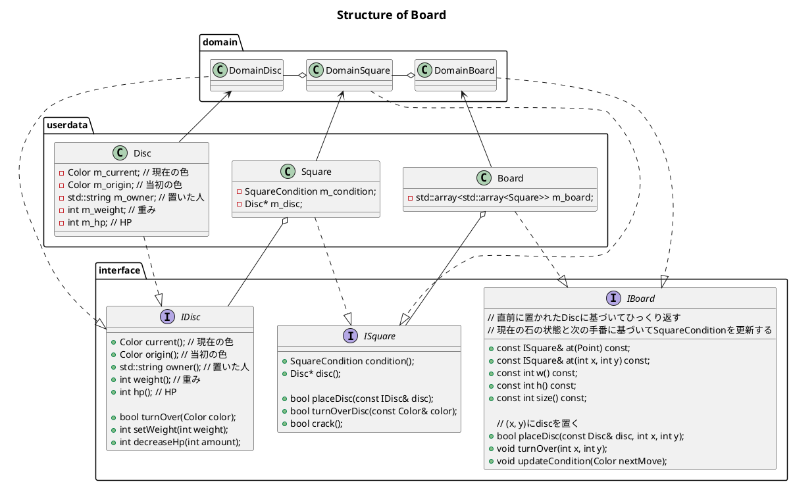

```plantuml
@startuml
title <size:18> Structure of Board </size>

package userdata {
    class Disc {
        -Color m_current; // 現在の色
        -Color m_origin; // 当初の色
        -std::string m_owner; // 置いた人
        -int m_weight; // 重み
        -int m_hp; // HP
    }
    class Square {
        -SquareCondition m_condition;
        -Disc* m_disc;
    }
    class Board {
        -std::array<std::array<Square>> m_board;
    }
}

package interface {
    interface IDisc {
        +Color current(); // 現在の色
        +Color origin(); // 当初の色
        +std::string owner(); // 置いた人
        +int weight(); // 重み
        +int hp(); // HP

        +bool turnOver(Color color);
        +int setWeight(int weight);
        +int decreaseHp(int amount);
    }
    interface ISquare {
        +SquareCondition condition();
        +Disc* disc();

        +bool placeDisc(const IDisc& disc);
        +bool turnOverDisc(const Color& color);
        +bool crack();
    }
    interface IBoard {
        +const ISquare& at(Point) const;
        +const ISquare& at(int x, int y) const;
        +const int w() const;
        +const int h() const;
        +const int size() const;

        // (x, y)にdiscを置く
        +bool placeDisc(const Disc& disc, int x, int y);
        // 直前に置かれたDiscに基づいてひっくり返す
        +void turnOver(int x, int y);
        // 現在の石の状態と次の手番に基づいてSquareConditionを更新する
        +void updateCondition(Color nextMove);
    }
}
Disc ....|> IDisc
Square ..|> ISquare
Square o-- IDisc
Board ..|> IBoard
Board o-- ISquare

package domain {
    class DomainDisc
    class DomainSquare
    class DomainBoard
}
Disc -up-> DomainDisc
Square -up-> DomainSquare
Board -up-> DomainBoard
DomainDisc .left.|> IDisc
DomainSquare ..|> ISquare
DomainBoard ..|> IBoard
DomainSquare o-left- DomainDisc
DomainBoard o-left- DomainSquare

@enduml
```
