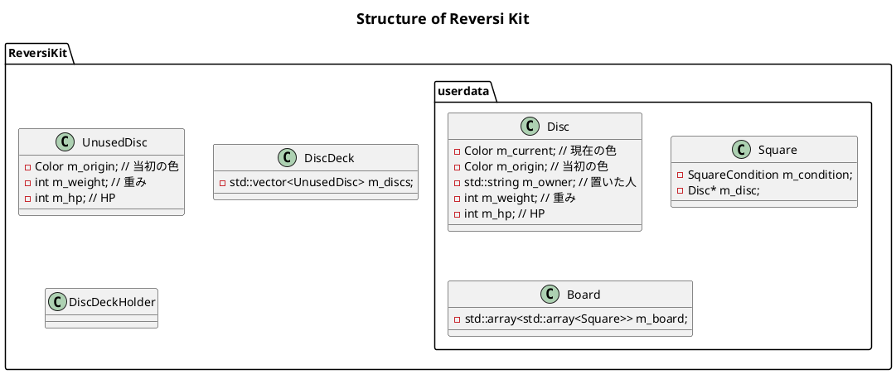
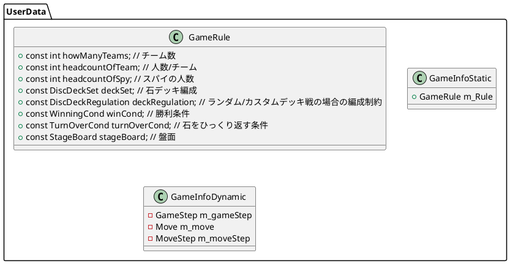
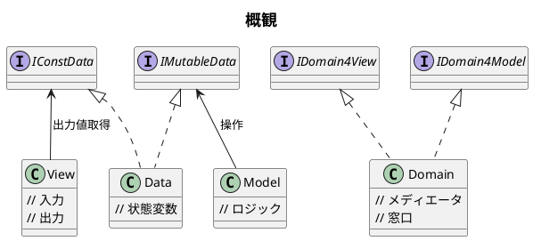
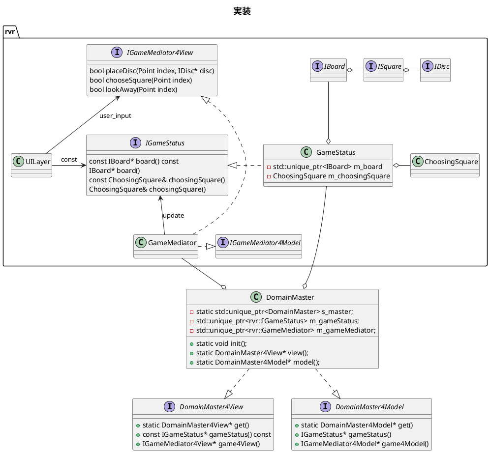
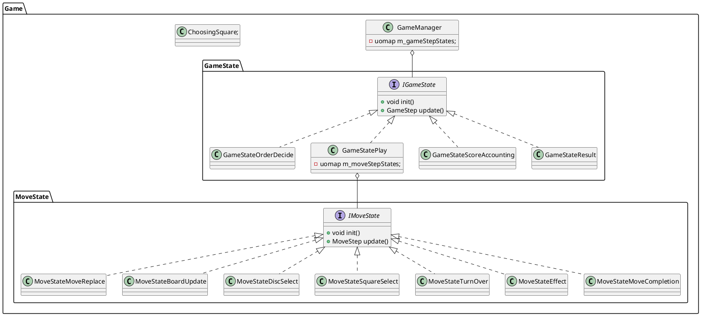
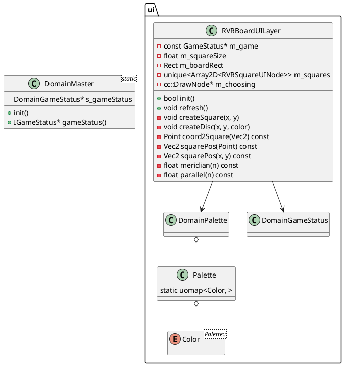
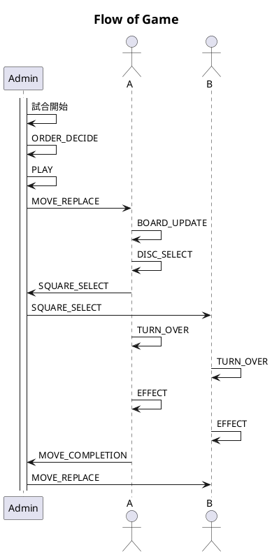
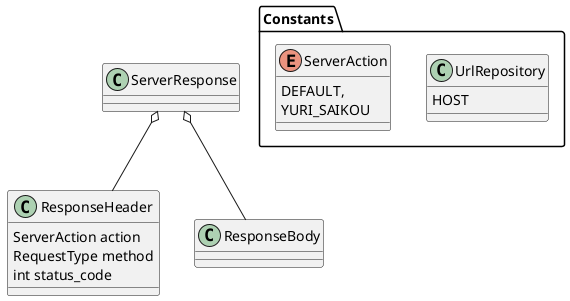

## Task

- [ ] InGame
    - [ ] 初期化とループ
    - [x] 使用済みの石が選べちゃう
    - [x] 石の上に置けちゃう
    - [x] 穴の上に置けちゃう
    - [x] デッキ石自動選択
    - [x] ID推進
    - [x] GameManager::takeNextStep()
        - [x] 棋譜
            - [x] MoveRecord
            - [x] GameRecord
    - [x] Assert解決
        - [x] virtual ~
    - [ ] パス
        - [ ] 両者パス時終了判定
    - [ ] GUI
        - [x] 石の数値切り替え
        - [x] 負の数
        - [ ] 仕様
        - [ ] PlayerProfile
        - [x] 得点
        - [ ] GameConfig
            - [ ] Deck::CUSTOM
            - [ ] Stage::CUSTOM
- [ ] OutGame
    - [x] ConfigScene
    - [x] TitleScene
    - [ ] PauseMenu
    - [ ] SequenseLoop
    - [ ] ResultMenu
        - [x] 結果表示
        - [ ] 戻る
            - [ ] タイトルへ
            - [ ] 設定へ
            - [ ] 再戦
- [ ] Platform
    - [x] Audio
    - [x] UI
        - [x] Node
        - [ ] BMFont
        - [ ] Switch
    - [x] DebugMenu
        - [x] ButtonSprite
        - [x] ButtonText
    - [ ] Rx
        - [ ] Where/SelectObservable<T>がなぜかObservableではなくSubjectを継承
        - [ ] ガベージコレクション

## 仕様

- [x] 画面 screen
    - [x] (x, y) = (0, 0)
    - [x] (w, h) = (1024, 768) (4 : 3)
- [ ] モード
    - [ ] 人数
        - [ ] 2-4陣営
        - [ ] チーム戦 (人数/陣営 > 1)
            - [ ] スパイ戦
    - [ ] 重み付き石
        - [x] 通常 = {∀重み==1}
        - [ ] 存在を奪い合うゲーム
            - [ ] 王様の石がただ一つ存在
                - [ ] 王様最後まで置かなければいいじゃん
                - [ ] 唯一はだめ
            - [ ] 重要な4つ、この4つが全部取られると負け
                - [ ] 複数あると取られにくそうなときにおける戦略性
            - [ ] 相手とのポイント差が空きすぎたらダメ
            - [ ] 最後まで持ってちゃダメな石
            - [ ] 遊戯王
                - [ ] 盤面上の自分の石 + デッキの石 == プレイヤーのHP
                - [ ] 一定以下で負け
            - [ ] 特定の石を奪われると存在も奪われる
                - [ ] 視覚
                    - [ ] 今の点数見えない
                        - [ ] 点数数えだすと時間食う
                        - [ ] 点数見えなくする前には時間制限つけたほうが良さそう
                    - [ ] 盤
                        - [ ] 石の色が見えない
                            - [ ] どれくらい見えない
                        - [ ] 石の数字が見えない
                        - [ ] 石が置いてあるかどうかが見えない
                        - [ ] 盤面すら見えない
                        - [ ] 現在誰の手番か以外何も見えない
                    - [ ] デッキ
                        - [ ] 石の数字が見えない
                            - [ ] デッキの石順番に並んどるやん
                        - [ ] 石が置いてあるかどうかが見えない
                - [ ] その他
                    - [ ] 置く石を選択できない
                    - [ ] 置くマスを選択できない
                - [ ] 聴覚
                    - [ ] 音無くなる
                    - [ ] ノイズ
                    - [ ] ヒント表示なし
                - [ ] ハンデの重さは実体験すべし
                - [ ] 手番の時間制限
                - [ ] Random in Common
                - [ ] 自分の
        - [ ] 体力制
    - [ ] 勝利条件
        - [ ] ポイント合計
        - [ ] 続行不能化
    - [ ] アイテム
        - [ ] 石に付与、相手に見えない
        - [ ] 一回ひっくり無効
    - [ ] その他ギミック
        - [ ] 持ち時間
        - [ ] 欠損盤
            - [ ] 静的/動的
        - [ ] 自然発生盤
        - [ ] 盤面ギミック変化
            - [ ] 炎
                - [ ] 陣営ごとに属性、優劣
            - [ ] 石の強さが変わる
                - [ ] 大富豪
    - [ ] 刻印有無
    - [ ] 可視か
    - [ ] マス選択
        - [ ] 離散: 普通
        - [ ] 連続: 選択した座標に最も近いマス
- [ ] 盤
    - [x] 8*8 = 64
        - [x] 狭そう
    - [ ] m*n
    - [x] 欠損
- [x] 石
    - [x] 黒/白
        - [x] 1-33, 0, 負, 特大, 数式
        - [x] 値は不連続、同じ値も存在し得る
        - [x] 正負で白黒は不可能
- [ ] 機能
    - [ ] オンライン対戦
        - [ ] オンラインに置くべき情報
            - [ ] 盤
            - [ ] 互いの所持石
            - [ ] 棋譜
            - [ ] ルール
            - [ ] 陣営/プレイヤー
    - [ ] 記録
        - [ ] ユーザプロフィール
            - [ ] 核
                - [ ] アイコン
                - [ ] 名前
            - [ ] コメント
            - [ ] フレンドリスト
            - [ ] フレンドコード
            - [ ] 勝数
            - [ ] レート
            - [ ] 称号
- [ ] HP
    - [ ] HPは減るのか、耐えるのか
    - [ ] HPと重みは分離するのか
    - [ ] 攻撃力は元のHPなのか、現在のHPなのか
- [ ] ユニークな要素は一度にたくさん入れすぎると人間の限界を超えて面白くなくなる

- [ ] ちゃん
    - デッキの空白
    - 中央4マスを目立たせる
    - マイナスなのにゲージが伸びる
    - マイナス戦のとき勝者が不在
    - 左下の表示バグ
    - 穴の位置は大事
        - 穴は面白い
    - Oがいっぱい並ぶと気持ち悪い
        - ローマ数字の0は空白でもいいかも
    - 正負混合はゲーム性のコントロールが難しい
        - 最小値と最大値の振れ幅が大きいと頭が追い付かない
        - 連続値じゃなく離散値

- [ ] ナガマルシェ
    - [ ] RPG
        - [ ] プレイヤー
            - [ ] スキル
            - [ ] 属性
        - [ ] 石→キャラクター
            - [ ] 育成
            - [ ] パーティ組む
            - [ ] アイテム持たせる

## 通信

- Room
    - 作成
        - ルームID
        - PlayerID
    - 参加
        - ルームID
        - PlayerID
- GameConfig
- InGame
    - 棋譜

---

### Flow

### English Terms

|日本語|English|
|:--:|:--:|:--:|
|盤|board|
|マス|square|
|石|disk (disc)|
|石を置く|place|
|挟む|bound|
|ひっくり返る|turn over|
|選択肢|option|
|手|move|
|手番|move|

~~~cpp
#define INT_ID_NS(Type, NameSpace)         \
namespace NameSpace {                      \
    class Type;                            \
    typedef dx::ID<Type> Type\\ID          \
    typedef const dx::ID<Type>& Type\\IDCR \
}

#define INT_ID_NS_OUT(Type, NameSpace)   \
namespace NameSpace {                    \
    class Type;                          \
}                                        \
typedef dx::ID<NameSpace::Type> Type\\ID \
typedef const dx::ID<NameSpace::Type>& Type\\IDCR
~~~

~~~cpp
// .hpp
class DomainXXXXXXXXXX {
public: // static_const/enum
    using THIS = DomainXXXXXXXXXX;
    using IMPL = XXXXXXXXXX;
public: // static
    static const IMPL& view() { return instance()->m_impl; }
    static IMPL& model() { return instance()->m_impl; }
private:
    static std::unique_ptr<THIS>& instance();
    static std::unique_ptr<THIS> s_instance;

public: // public function
private: // field
    IMPL m_impl;

private: // private function
    void init();

private: // ctor/dtor
    DomainXXXXXXXXXX() = default;
};
~~~

~~~cpp
// .cpp
/* ---------- DomainXXXXXXXXXX ---------- */

// static ----------------------------------------
std::unique_ptr<DomainXXXXXXXXXX>& DomainXXXXXXXXXX::instance() {
    if (s_instance == nullptr) {
        s_instance = STD_MAKE_UNIQUE(DomainXXXXXXXXXX);
        s_instance->init();
    }
    return s_instance;
}
std::unique_ptr<DomainXXXXXXXXXX> DomainXXXXXXXXXX::s_instance = nullptr;
// public function -------------------------------
// private function ------------------------------
void DomainXXXXXXXXXX::init() {

}
// ctor/dtor -------------------------------------
~~~

## DomainXXX

### Platform
- AudioMgr
- AddToNodeReleaseManager
- Scheduler
- ApplicationManager
- EventStream
- UIManager
- FontAsset
- Client

### Main
- MainApplicationManager
- GameManager
- (GameStatus): unused
- PlayerManager
- GameRecord
- GameConfig
- Master
    - 4View
    - 4Model

- Board
- Square
- Disc
- PlayerProfileCore
- PlayerProfile

## 通信

~~~cpp
- req = ServerGetRequest::create(ServerAction)
    - req->setResponseCallback({})
    - req->setRequestData(ToJson(requestData))
    - DomainClient::send(req)
        - cc::HttpClient::send(req->impl:cc::HttpRequest)
            - impl.url = req->url + "?" + data.toQuery
            - // ec2XXX.com?user_id=XXX&data=YYY
~~~
